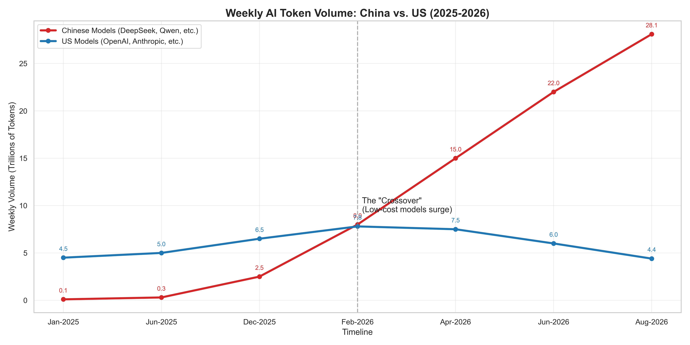
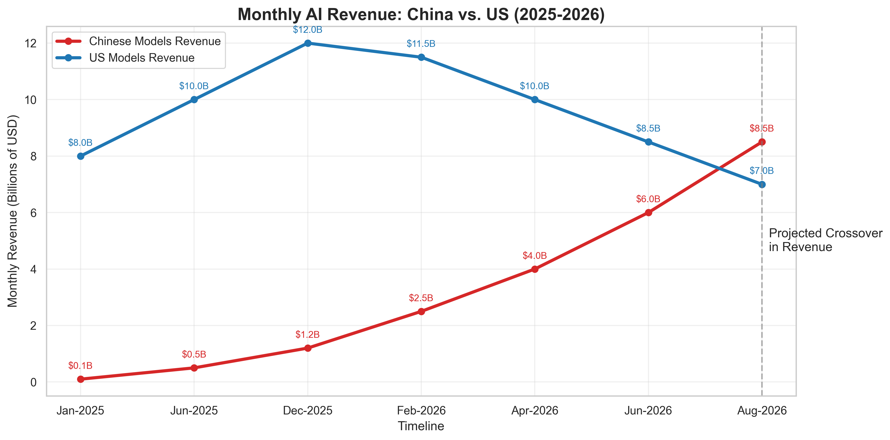

<div align="center">
  
</div>

<p align="center">
  <a href="https://github.com/ishandutta2007/Awesome-Awesome-Awesome"></a><a href="https://discord.gg/jc4xtF58Ve"></a>
  <a href="https://github.com/ishandutta2007"></a>
</p>

# 🇨🇳 China vs 🇺🇸 US AI Token Volume Visualization (2025-2026) 📈

An analytical data visualization project comparing weekly AI token volume between **Chinese AI models** 🐉 (such as DeepSeek, Qwen) and **US AI models** 🦅 (such as OpenAI, Anthropic). This Python-based project highlights key industry trends, including the projected **"Crossover Event"** ⚔️ in early 2026 where low-cost Chinese models surge in global usage, potentially signaling an AI bubble burst or market shift 💥.





## 🚀 Features
- **Data Visualization 📊**: Clear, annotated line charts tracking weekly token volume in trillions.
- **Trend Analysis 🔍**: Visually highlights the crossover point between US AI and Chinese AI token usage.
- **Modern Python Data Stack 🐍**: Built with `pandas` 🐼, `matplotlib` 📉, and `seaborn` 🌊 for publication-ready, high-quality graphs.

## 🔑 Keywords for SEO
AI Token Volume, Chinese AI Models, DeepSeek, Qwen, US AI Models, OpenAI, Anthropic, AI Bubble, Matplotlib Data Visualization, AI Market Analysis, AI Trends 2025-2026.

## 🛠️ Installation

Clone the repository and install the required Python dependencies:

```bash
git clone https://github.com/ishandutta2007/Chinese-Pops-US-AI-Bubble.git
cd Chinese-Pops-US-AI-Bubble
pip install pandas matplotlib seaborn
```

## 📊 Usage

Run the Python scripts to generate the annotated visualizations:

```bash
python China_vs_USA_usage.py
python China_vs_USA_revenue.py
```
*(Note: Use `python3` or `py` depending on your environment setup).*

## 📁 Project Structure
- 📜 `China_vs_USA_usage.py`: The core script that loads the data, formats the graph, and plots the annotated chart for token volume.
- 📜 `China_vs_USA_revenue.py`: The script for comparing AI model revenue.
- 🎨 `assets/banner.svg`: Dynamic animated banner for the project.
- 🖼️ `assets/plot.png`: Generated token volume visualization output.
- 🖼️ `assets/revenue_plot.png`: Generated revenue visualization output.

## 📈 Data Context
The dataset is estimated from **OpenRouter** and various industry reports spanning 2025-2026, mapping out the trajectory of AI model adoption globally 🌍.

## 📄 License
This project is open-source and available under the [MIT License](LICENSE).

## Star History
<div align="center">
<a href="https://www.star-history.com/?repos=ishandutta2007%2FChinese-Pops-US-AI-Bubble&type=date&legend=bottom-right">
<picture>
<source media="(prefers-color-scheme: dark)" srcset="https://api.star-history.com/chart?repos=ishandutta2007/Chinese-Pops-US-AI-Bubble&type=date&theme=dark&legend=bottom-right" />
<source media="(prefers-color-scheme: light)" srcset="https://api.star-history.com/chart?repos=ishandutta2007/Chinese-Pops-US-AI-Bubble&type=date&legend=bottom-right" />

</picture>
</a>
</div>